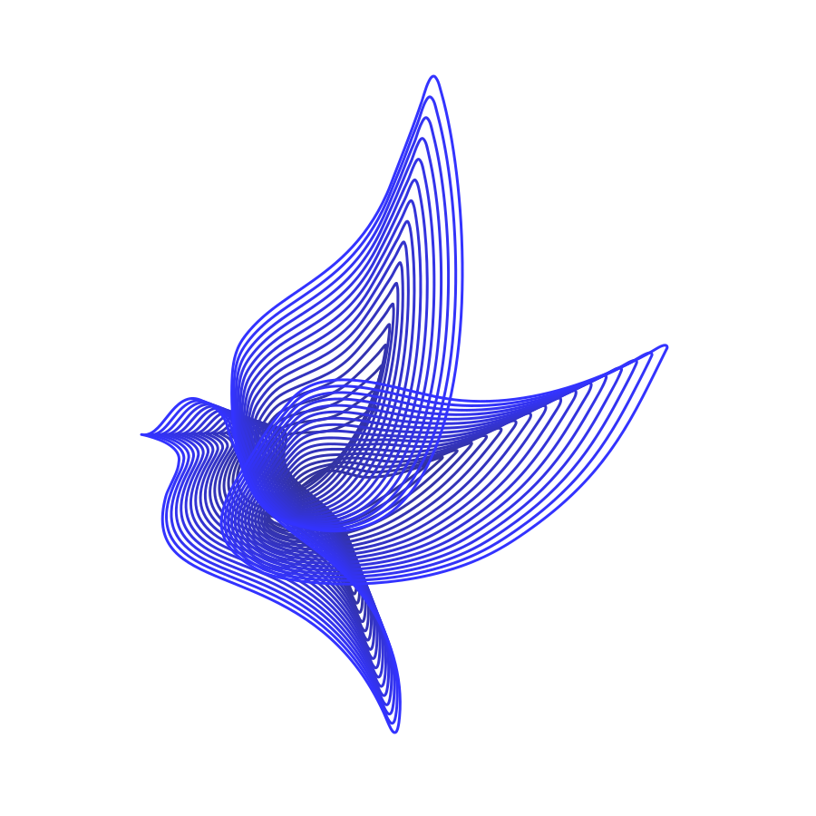

# Free Me – Vegan Advocacy Site
*A vegan platform advocating for compassion, sustainability, and freedom for all living beings.*

## Demo
👉 [This site is live on GitHub Pages](https://jakasienka.github.io/vegan-platform/)

<p align="center">
  
</p>

## Development Notes 🔧

### Cross-Platform Friendly 🌍

This project works across **Linux 🐧, macOS 🍏, and Windows 🪟**.  

- On **Windows**, the `wdm` gem in the `Gemfile` just makes file watching faster. If you’re on **Linux** or **macOS**, Bundler will quietly skip it — nothing to worry about.  
- All paths use `/`, which is standard across all platforms 🌱.  

So whether you’re on Linux, macOS, or Windows, you can clone the repo and start developing right away. ✨

## Local Preview
Requires Ruby and Bundler installed.

```bash
gem install jekyll bundler
bundle install
bundle exec jekyll serve
```

Then open: http://localhost:4000

## Colors
- Green: #66CC66
- Blue: #3333FF
- Blue Deep: #333399
- Content: #FAFAFA
- Muted: #888

## Structure
- index.html – Entry page with logo, vertical entry button.
- home.md – Articles page.
- _posts/ – Blog posts.
  - Includes _posts/2025-01-01-sample-do-not-remove.md as a template.
- getting-vegan/index.md - Guide/help to go vegan
- posts/index.html - Search results
- about.md - Purpose, animal movement organizations, and petitions.
- assets/css/style.css – Styles with color variables.
- assets/js/articles.js - Searching Articles.
- assets/js/pillar.js - Interactivity.
- assets/img/ – All images.

## Contributing
We welcome contributions from everyone ✨  
You don’t need to be a developer to help!

- **New to GitHub?** No problem — you can [open an issue](https://github.com/jaKasienka/vegan-platform/issues) with your idea, article text, or resource link.  
- **Want to add content?** Fork this repository, create a new branch, and add your posts in the `_posts/` folder. You can also update `about.md` with organizations, resources, or petitions (see instructions below).
- **Not sure about Git?** Just share your idea in an issue and we’ll help you include it 💚  

### 1. **Fork** this repository and clone it locally.

### 2. Create a **new branch** for your changes:
```bash
git checkout -b my-feature
```

### 3. Add or update content
   
- Adding Posts 
  - Posts go in `_posts/` with filenames like `YYYY-MM-DD-title.md`.
  - Start each post with YAML front matter:
    ```yaml
    ---
    layout: post
    title: "My Vegan Insight"
    ---
    ```

  - For convenience, copy the `_posts/2025-01-01-sample-do-not-remove.md` template and edit it.

- Update about.md if you’d like to add organizations, resources, or petitions.
   
- Whatever you write please keep the tone inclusive and compassionate.

- Images go in `assets/img/`. Use relative paths like:
  ```html
  
  ```

### 4. Commit and push your changes (see **Commit Style** below):
```bash
git commit -m "feat: add new article on [topic]"
git push origin my-feature
```

#### Commit Style
We use Conventional Commits

- feat: new posts, new pages (about.md, getting-vegan/), new sections in the layout.
- fix: correcting typos, broken links, wrong dates, or images not loading.
- docs: updating the README.md or contributor guidelines.
- style: changing CSS (colors, spacing) without altering functionality.
- refactor: restructuring code/JS without changing how it works (e.g. cleaning articles.js).
- test: if you ever add tests (probably not needed for now).
- chore: dependency updates (Gemfile), config changes, build-related tweaks.

#### Examples:
```txt
feat: add highlighted card for getting vegan guide
fix: correct petition link on about page
docs: update README with setup instructions
style: adjust button spacing on homepage
chore: update Gemfile dependencies
```

👉 Keep commit subjects short (~50 chars), use present tense, and add extra detail in the body if needed.

### 5. Push to your fork and open a **Pull Request** on GitHub.

## License
MIT
By contributing, you agree that your work will be licensed under the MIT License.